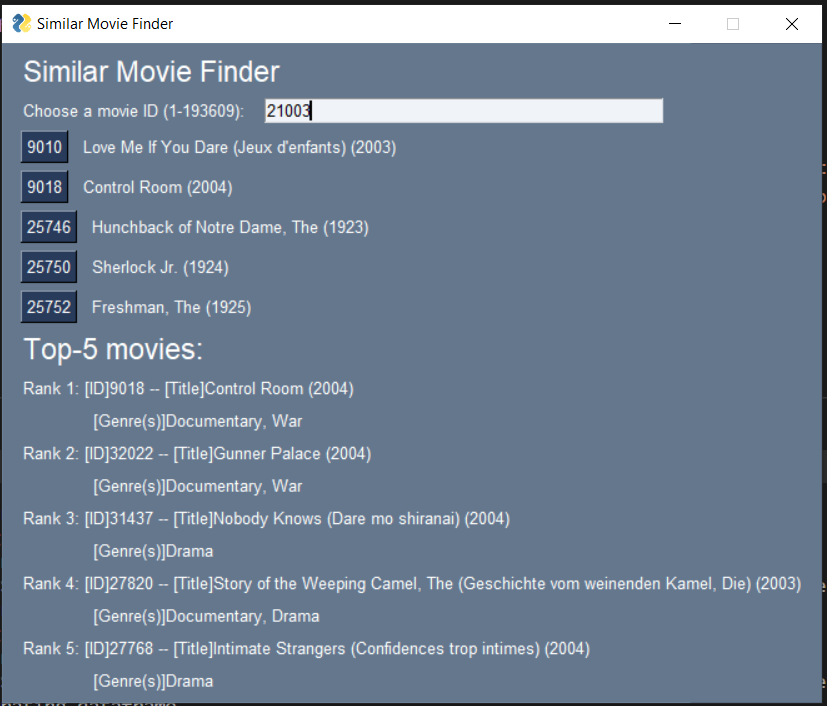

# Recommendation System for MovieLens data

The data can be downloaded from [here](https://grouplens.org/datasets/movielens/#:~:text=MovieLens%20Latest%20Datasets&text=Small%3A%20100%2C000%20ratings%20and%203%2C600,Last%20updated%209%2F2018.&text=Full%3A%2027%2C000%2C000%20ratings%20and%201%2C100%2C000,relevance%20scores%20across%201%2C100%20tags.), see the "Recommended for Education and Development" section. 
Unzip the data and it should looked like below:
```
.
├── ml-latest-small
|   ├── links.csv
|   ├── movies.csv
|   ├── ratings.csv
|   ├── README.txt
|   └── tags.csv
├── README.md
└── ...
```
## Understand the data

The `movies.csv` file has 3 columns.
It consists of the Movie's id, its title and its genre. 
Note that a movie can belongs to multiple genres, where genres
are seperated by pipes `|` in the file. 
Some of the movie titles has double quotes on both ends, some do not, 
regardless of whether there is whitespace in the title. 
Moreover, it seems very consistently there will be the release year of the movie
at the end of the movie title, in parentheses.  

The `links.csv` file has 3 columns.
It consists of the Movie's id, and its corresponding ids in IMDB and TMDB database. 
To utilize the ID's, view [TMDB API](https://developers.themoviedb.org/3/find/find-by-id) and [Guide for IMDB ID](https://zappiti.uservoice.com/knowledgebase/articles/1979001--identification-use-imdb-id-to-identify-your-movi).

The `tags.csv` file has 4 columns.
It consists of the User ID, Movie ID, Tag, and timestamp.
It represent the time (timestamp) when a single user assign a tag he/she seems relevant to the movie. 

The `ratings.csv` file has 4 columns.
It consists of the User ID, Movie ID, rating, and timestamp.
Rating is a float from 1 to 5, often by 0.5 increment. 

## Configuration

Python 3.9 or above is required, there are two ways to configure your system before running any scripts. 

[Kindly note that running all files in this repository will use up to 1GB of your machine storage.
See the storage break-down in each subsection below.]

### Virtual Environment (Recommended)

Open a terminal, install virtual environment by `pip`:
```
pip install virtualenv 
```
Then inside the working directory, start a virtual environment:
```
virtualenv venv
``` 
You will notice a directory `venv/` is created. 
Choose the `venv/` virtual environment for the terminal:
```
# Windows
./venv/Scripts/activate
# Linux
source venv/bin/activate
```

Install required packages by
```
pip install -r requirements.txt
```

[Using Virtual Environment will used up to 340Mb of disk storage]

### Install packages directly (For experienced developers)

If you're a Python developer like me who is interested in machine learning, you probably already have most of the packages installed. 
In case you don't mind adding a few more packages to your computer, run the install script below directly:
```
pip install -r requirements.txt
```

Now you're ready to go.


## Analyze the data

Run `analyze.py` after downloaded all necessary CSV files. 
It will gives a summary of the data. 

We found that in `links.csv`, the column `tmdbId` has 8 missing values out of 9742. 
Therefore, it is safe to just remove them without affecting the quality of the model. 

## Computation

Run `main.py` to calculate similarities with various methods based on users and items. 
Currently Cosine similarity, Pearson Correlation and KNN are implemented. 

After running 
```
python main.py
```
, see `./output/` for the output data.
All of the required data can be generated by simply running `main.py`, 
the data can then be reused in other scripts. 

[After running the script, the `./output/` directory will consume up to 700Mb of disk storage.]

## Applications

Here we have several applications using the results of computation above. 

### K-Nearest Neighbors for Movies

This application is to recommend similar movies to the chosen movie. 

Run
```
python KNN_interactive.py
```

Then a GUI will show up. 
Enter some integer, which refers to the movie's ID and shows its title besides it. 
Then, click on a button with movie's ID to see the other 4 movies related to it,
alongside with its genres. 

The relation is based on the distance from user ratings. 

